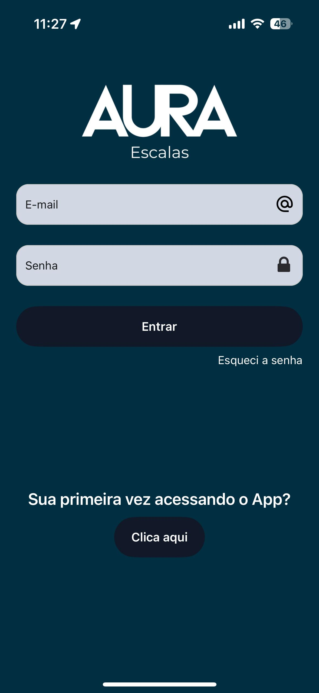
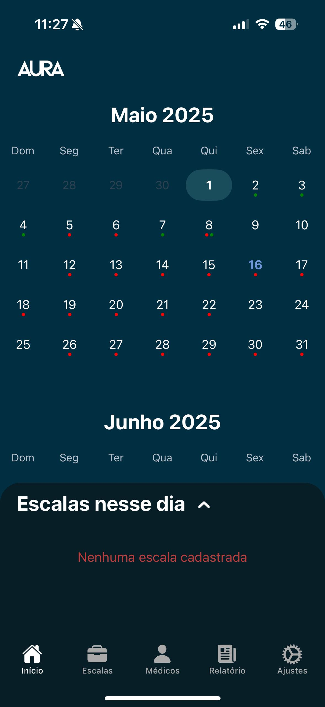
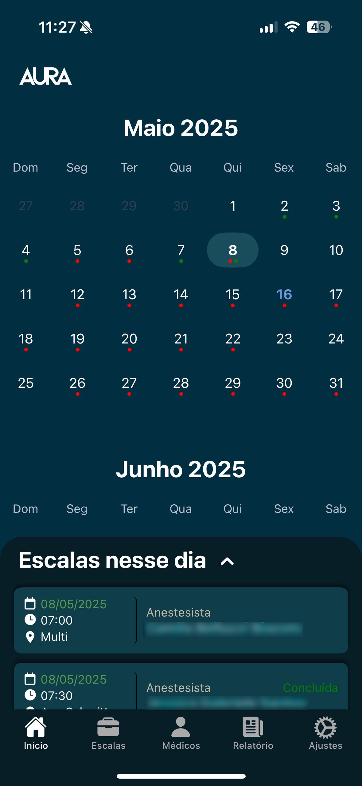
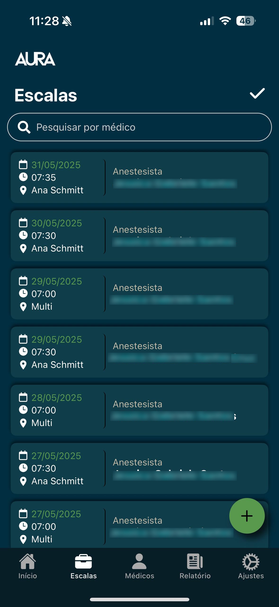
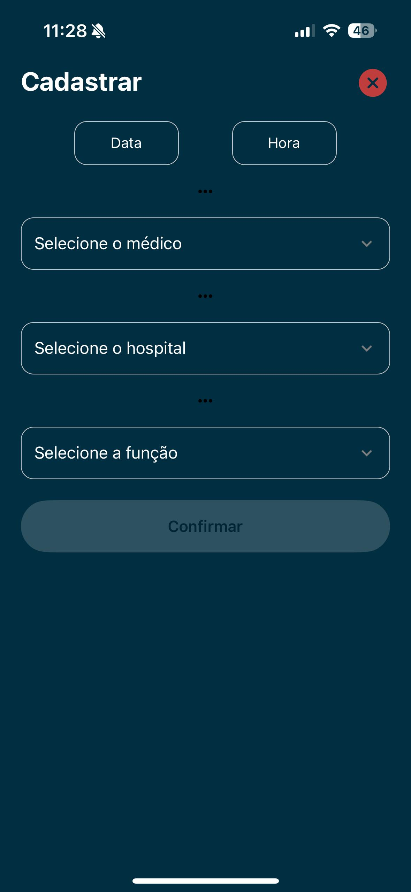
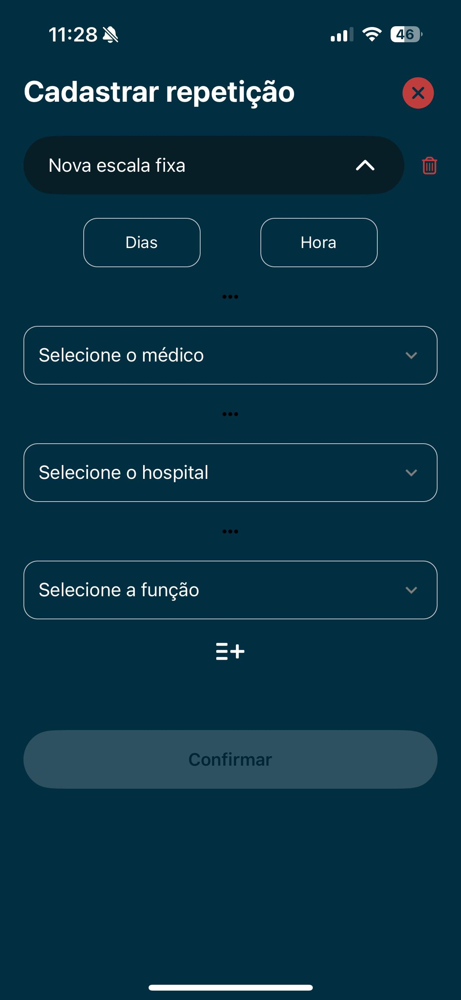
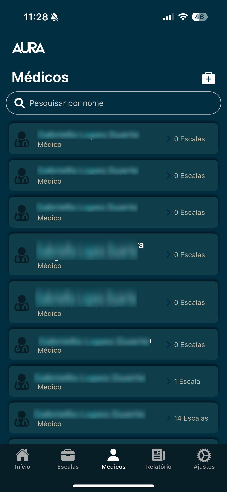
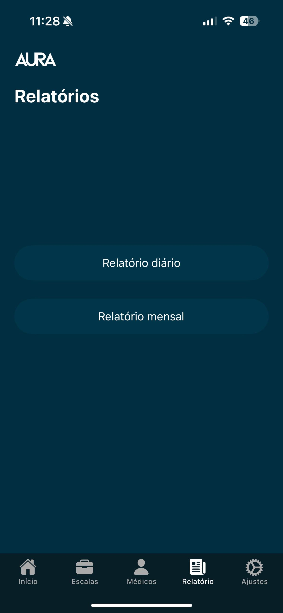
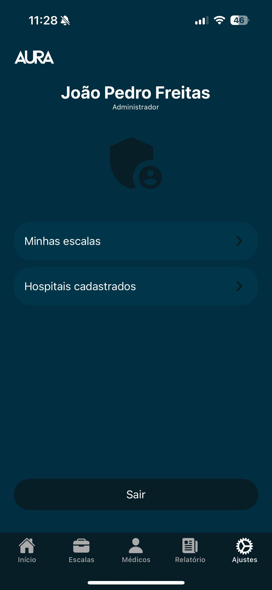

# 📅 Aura Escalas

Aplicativo mobile (Atualmente somente com suporte para IOS) desenvolvido para auxiliar na gestão de escalas de profissionais da saúde, facilitando o controle de plantões e turnos em clínicas e hospitais.

## 🚀 Tecnologias Utilizadas

- **React Native** com Expo
- **TypeScript**
- **Firebase** (Autenticação e Firestore)
- **React Navigation**
- **Styled Components**

## 🧩 Funcionalidades

- Cadastro e autenticação de usuários
- Visualização de escalas semanais/mensais
- Notificações de alterações nas escalas
- Interface intuitiva adaptada para uso clínico
- Diferente funções para médicos e administradores
- Relatórios completos de plantões em aberto e concluídos

## 👨‍💻 Meu Papel no Projeto

Atuei diretamente durante todo o ciclo de vida da aplicação, inclusive atualmente na manutenção:

- **Levantamento de Requisitos**: Colaborei com a equipe médica para entender as necessidades específicas da gestão de escalas.
- **Desenvolvimento**: Implementei a interface e a lógica de negócios utilizando React Native e Firebase.
- **Qualidade de Software**: Realizei testes para garantir a estabilidade e usabilidade do aplicativo.

## 🖼️ Capturas de Tela

### 🔐 Login

### 🏠 Telas iniciais

### 📅 Escalas

### 👨‍⚕️ Médicos

### 📊 Relatórios

### ⚙️ Configurações

## ⚠️ Aviso Legal

Este repositório é propriedade privada. **Todos os direitos reservados.**

Nenhum trecho deste código pode ser copiado, reproduzido, distribuído ou utilizado, total ou parcialmente, sem a permissão explícita do autor.

Se tiver interesse em utilizar este projeto, entre em contato via [LinkedIn](https://www.linkedin.com/in/joaopfreitas8/).
